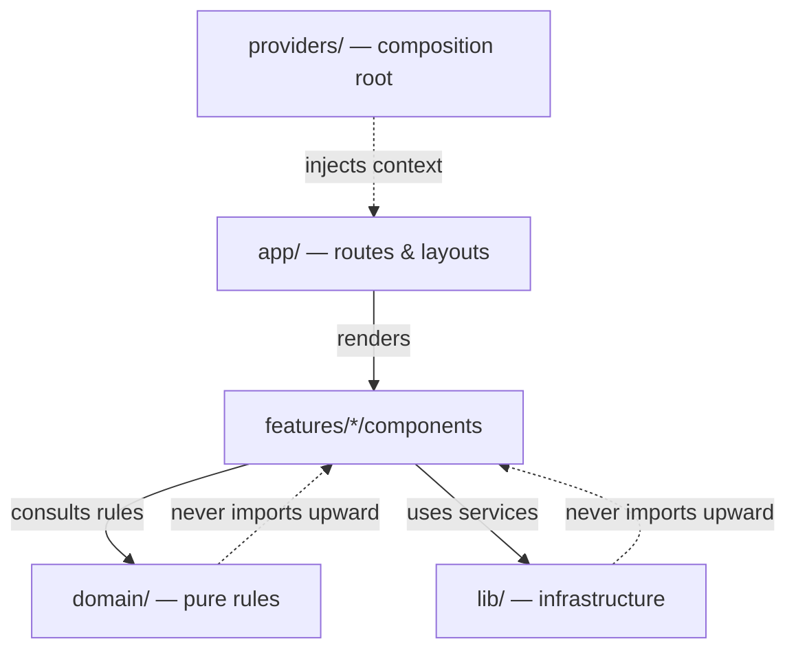
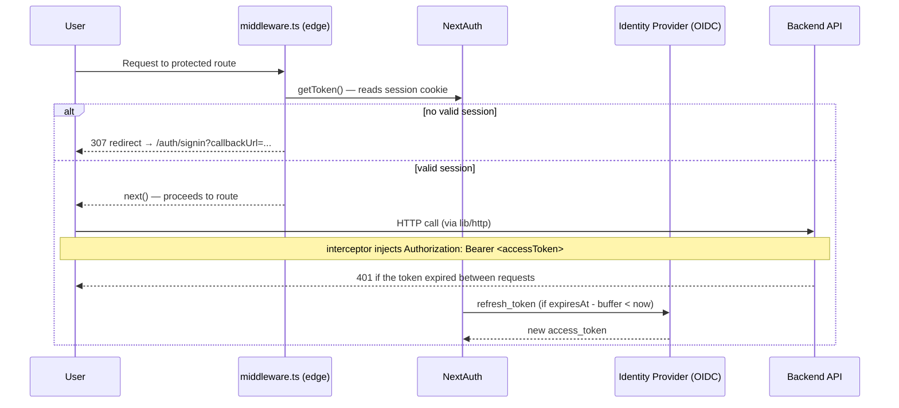

Every frontend architecture looks perfect on day zero. With three screens
and a single developer in the repo, any folder structure works — and it's
easy to convince yourself it'll scale. The gap between what actually works
and what just looks like it works only shows up later: once the project
crosses thirty screens, the team grows from two people to six, and each one
ends up inventing their own way to call the API or handle authentication.

That's roughly what happened to us a few months ago. There wasn't one
dramatic incident — it was accumulation: a `Button` component importing an
orders hook, an API response with `any` leaking all the way to the JSX, two
different HTTP client implementations coexisting because nobody was sure
anymore which one was the "official" one. Nothing broke the system all at
once, but every PR got slower to review, and every refactor had a higher
chance of bleeding into some unexpected corner.

That accumulation is what pushed us to restructure the frontend pattern we
use in production — trying to extract what actually worked in the projects
that survived growth well, and turn it into a repeatable model for the next
ones.

Below are the principles and patterns that stuck, in practice, after a few
rounds of adjustment.

---

## 1. The 4 Guiding Principles

To avoid endless Code Review arguments about "where should this file live",
we settled on four clear rules.



### Single Dependency Flow (`app → features → domain / lib`)

A lower layer never imports from a higher one. `domain/` doesn't know React
exists. `lib/` doesn't know which product is running on top of it. If your
domain layer needs to import something from a UI component, the design is
inverted.

### Feature-Based Organization

We dropped the "file type" structure (`components/`, `hooks/`, global
`services/`). Code is grouped by **product domain** instead
(`features/orders`, `features/billing`). Each feature works almost like an
isolated package, holding its own components, schemas, and hooks.

### The Network Boundary Is Untrustworthy

Every API response is treated as unknown until it passes through a runtime
validation schema (Zod). Frontend-generated types don't blindly trust the
backend payload; it gets parsed before it ever reaches the UI.

### Public Module via Barrel (`index.ts`)

Each feature exposes only what's declared in its `index.ts`. If a file
lives inside the feature folder but isn't exported by `index.ts`, it's an
internal implementation detail. Other modules should never import it
directly.

---

## 2. The Structure in Practice

The project structure is organized as follows:

```text
src/
├── app/                    # Next.js App Router: routes, layouts, composition.
│   ├── (dashboard)/        # Pages and groups with no embedded business logic.
│   └── api/                # Route Handlers (thin BFF: proxy, webhooks).
│
├── features/                # Product domains.
│   └── orders/
│       ├── index.ts          # Barrel: the single public entry point.
│       ├── api.ts            # HTTP requests and schema parsing.
│       ├── schema.ts          # Zod schemas and conversions (DTO -> Domain).
│       ├── hooks.ts           # Encapsulated React Query.
│       └── components/        # Components exclusive to this feature.
│
├── domain/                  # Pure rules. Zero dependency on React or HTTP.
│   ├── order-status.ts        # State machines, calculations, invariants.
│   └── order-status.test.ts   # Fast unit tests, no mocks.
│
├── lib/                     # Business-agnostic infrastructure.
│   ├── http/                  # HTTP client isolated behind a factory.
│   ├── auth/                   # Session and refresh configuration.
│   └── guard/                   # Access control (RBAC).
│
├── components/ui/            # Pure Design System (Radix / Tailwind / shadcn).
└── providers/                # Application composition root.
```

### Rules Enforced in Review

1. **Zero leakage:** Importing `features/x/api.ts` directly from outside the
   feature fails CI. Access must go through `features/x`.
2. **Design System isolation:** A component in `components/ui/` must never
   contain business rules or product entity names.

---

## 3. Design Patterns Applied

Instead of forcing design patterns for theoretical vanity, we let them
emerge from actual technical necessity.

### Factory for Infrastructure Clients

We tried a rigid global instance and also a class with dependency injection
before landing here. Both work, but they bring ceremony that doesn't pay
rent in a frontend. What stuck were *Factory Functions*: functions that
create reusable services with private state kept safe via *closures*, with
no `new` and no DI container.

```ts
// lib/http/client.ts
export function createHttpClient(baseURL: string, options: Options = {}): HttpClient {
  const client = axios.create({ baseURL, ...options });

  client.interceptors.request.use(async (config) => {
    const session = await getSession();
    if (session?.accessToken) {
      config.headers.Authorization = `Bearer ${session.accessToken}`;
    }
    return config;
  });

  return client;
}
```

### Anti-Corruption Layer (DTO → Domain Adapter)

To keep API contract changes from breaking the user interface, we map
network payloads to internal domain types right at the entry layer.

```ts
// features/orders/schema.ts
export const orderDtoSchema = z.object({
  order_id: z.string(),
  total_amount: z.number(),
  status: z.enum(["draft", "review", "approved"]),
});

export function toOrder(raw: unknown): Order {
  const dto = orderDtoSchema.parse(raw);
  return {
    id: dto.order_id,
    total: dto.total_amount,
    status: dto.status,
  };
}
```

If the backend team renames `total_amount` to `amount_cents`, we only touch
the adapter inside `schema.ts`, keeping every component untouched.

---

## 4. Authentication and Security at the Edge

Authentication (**who you are**) and Authorization (**what you can do**)
are treated as independent layers.



### The Token Expiration Buffer

We learned this the hard way. Before the buffer existed, the *Access
Token* refresh fired at the exact second it expired. On a Friday night, a
network latency spike made a batch of in-flight requests hit `401` at the
same time — and, worse, each one fired its own refresh against the IdP,
which started invalidating sessions due to too many concurrent *refresh
tokens* for the same user. The result: users got logged out en masse, with
no obvious error in the frontend logs.

Two changes fixed it: a scheduled renewal buffer (~60 seconds before the
token's actual expiration) and having concurrent *refresh* requests share
the same in-flight `Promise`, instead of each one firing its own call to
the Identity Provider.

---

## 5. Declarative Authorization (RBAC)

Checks like `if (user.roles.includes('admin'))` scattered across
components are easy to write and easy to forget to update — on a new
screen, or in a condition that went stale after a role got renamed. We'd
rather centralize the rule in one place and let the UI ask only about the
action, with no idea which role sits behind it.

```ts
// lib/guard/permix.ts
type PermissionsDefinition = {
  orders: ["view", "manage"];
  billing: ["access"];
};

export const permix = createPermix<PermissionsDefinition>();

export function setupPermissionsFromToken(token: string | undefined) {
  const { valid, roles } = decodeTokenRoles(token);
  const isAdmin = roles.has("org-admin");

  permix.setup({
    orders: { view: valid, manage: isAdmin },
    billing: { access: isAdmin },
  });
}
```

Components query the permissions engine by simply asking about the action:

```tsx
// The UI doesn't need to know WHICH roles grant access to this action
const canManageOrders = usePermission("orders", "manage");

if (!canManageOrders) return null;

return <Button>Create Order</Button>;
```

---

## Good practices before opening a PR

None of these rules solves anything on its own — what works is the
combination, and especially having CI enforce it instead of relying on a
human reviewer to remember everything. A few things we check today:

- **`app/` only composes.** If a `page.tsx` has business logic beyond
  fetching data and assembling components, it belongs in `features/` or
  `domain/`.
- **Feature access goes through `index.ts`.** Importing `features/x/api.ts`
  directly from outside breaks CI — that's how we prevent leakage.
- **Every API response goes through a schema before becoming a prop.** Zod
  isn't bureaucracy here — it's the only thing standing between a backend
  silently renaming `total_amount` and that value becoming `undefined` on
  the user's screen.
- **A single HTTP client, built by the factory.** A stray `fetch` or
  `axios` instance inside a component is the first sign the convention
  didn't stick.
- **`domain/` never imports React or HTTP.** If one of those imports shows
  up in there, it's a sign the business rule belongs somewhere else.
- **Authorization in the UI is UX, not security.** The permission check on
  the frontend just keeps someone from seeing a button they shouldn't —
  the validation that actually matters still happens on the backend,
  always.

## Conclusion

Frontend architecture isn't about drawing the prettiest diagram — it's
about lowering the cost of everyday decisions: where a file goes, who can
import what, what needs to pass through a schema before becoming a prop.
When those answers become obvious, the team spends its energy on the
product problem instead of arguing about folders. It's not a perfect
architecture — it's the one that survived our own growth up to this point,
and we'll probably rewrite a piece of it a year from now.
