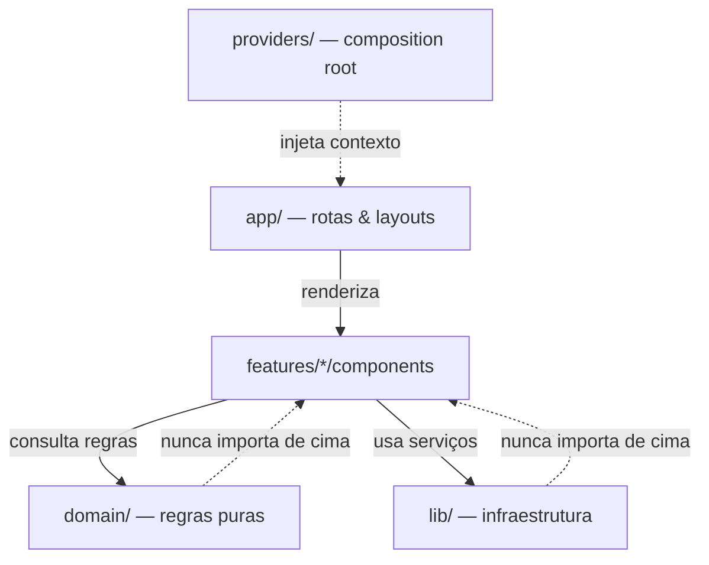
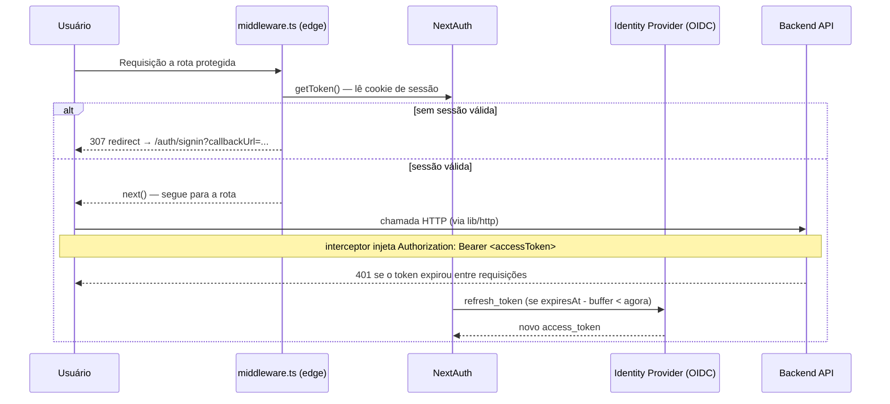

Toda arquitetura frontend parece perfeita no dia zero. Com três telas e um
único desenvolvedor no repositório, qualquer organização de pastas funciona
— e é fácil se convencer de que aquilo vai escalar. A separação entre o que
funciona e o que só parece funcionar só aparece depois: quando o projeto
passa de trinta telas, o time cresce de duas para seis pessoas e cada uma
resolve criar sua própria forma de chamar a API ou tratar autenticação.

Foi mais ou menos isso que aconteceu com a gente há alguns meses. Não teve
um incidente único e dramático — foi acúmulo: um componente de `Button`
importando um hook de pedidos, resposta de API com `any` vazando até o JSX,
duas implementações de client HTTP diferentes coexistindo porque ninguém
sabia mais qual era a "oficial". Nada quebrou o sistema de uma vez, mas cada
PR ficava mais lento de revisar e cada refactor tinha mais chance de sangrar
em algum canto inesperado.

Foi esse acúmulo que nos fez reestruturar o padrão de frontend que usamos em
produção — tentando extrair o que realmente funcionou nos projetos que
sobreviveram bem ao crescimento, e transformar isso num modelo replicável
para os próximos.

Abaixo estão os princípios e os padrões que ficaram, na prática, depois de
alguns ciclos de ajuste.

---

## 1. Os 4 Princípios Norteadores

Para evitar discussões infinitas em Code Reviews sobre "onde esse arquivo
deveria morar", definimos quatro regras claras.



### Fluxo de Dependência Único (`app → features → domain / lib`)

Uma camada inferior nunca importa de uma camada superior. A pasta `domain/`
não sabe que o React existe. A pasta `lib/` não sabe qual produto está
rodando. Se o seu domínio precisa importar algo de um componente de UI, o
design está invertido.

### Organização Por Feature (Feature-Based)

Abandonamos a estrutura por "tipo de arquivo" (`components/`, `hooks/`,
`services/` globais). O código é agrupado por **domínio de produto**
(`features/orders`, `features/billing`). Cada feature funciona quase como
um pacote isolado, contendo seus próprios componentes, schemas e hooks.

### A Borda de Rede é Inconfiável

Toda resposta de API é tratada como desconhecida até que passe por um
schema de validação em runtime (Zod). Tipos gerados no frontend não confiam
cegamente no payload do backend; eles passam por parsing antes de chegar à
interface.

### Módulo Público via Barrel (`index.ts`)

Cada feature expõe apenas o que está declarado em seu `index.ts`. Se um
arquivo está dentro da pasta da feature mas não foi exportado pelo
`index.ts`, ele é uma implementação interna. Módulos externos não devem
importá-lo diretamente.

---

## 2. A Estrutura na Prática

A estrutura do projeto fica organizada da seguinte forma:

```text
src/
├── app/                    # Next.js App Router: rotas, layouts e composição.
│   ├── (dashboard)/        # Páginas e grupos sem lógica de negócio encapsulada.
│   └── api/                # Route Handlers (BFF fino: proxy, webhooks).
│
├── features/                # Domínios de produto.
│   └── orders/
│       ├── index.ts          # Barrel: único ponto de entrada público.
│       ├── api.ts            # Requisições HTTP e parsing de schemas.
│       ├── schema.ts          # Schemas Zod e conversões (DTO -> Domínio).
│       ├── hooks.ts           # React Query encapsulado.
│       └── components/        # Componentes exclusivos desta feature.
│
├── domain/                  # Regras puras. Zero dependência de React ou HTTP.
│   ├── order-status.ts        # Máquinas de estado, cálculos e invariantes.
│   └── order-status.test.ts   # Testes unitários rápidos e sem mocks.
│
├── lib/                     # Infraestrutura agnóstica de negócio.
│   ├── http/                  # Cliente HTTP isolado por factory.
│   ├── auth/                   # Configuração de sessão e refresh.
│   └── guard/                   # Controle de acesso (RBAC).
│
├── components/ui/            # Design System puro (Radix / Tailwind / shadcn).
└── providers/                # Composition Root da aplicação.
```

### Regras Travadas no Review

1. **Zero vazamento:** Importar `features/x/api.ts` diretamente de fora da
   feature faz a CI falhar. O acesso é obrigatoriamente por `features/x`.
2. **Isolamento do Design System:** Um componente em `components/ui/` nunca
   deve conter regras de negócio ou nomes de entidades de produto.

---

## 3. Padrões de Design Aplicados

Em vez de forçar padrões de design por vaidade teórica, deixamos que eles
surgissem da necessidade técnica.

### Factory para Clientes de Infraestrutura

Testamos instância global e também classe com injeção de dependência antes
de chegar aqui. As duas funcionam, mas trazem cerimônia que não paga aluguel
num frontend. O que ficou foram *Factory Functions*: funções que criam
serviços reutilizáveis com estado privado seguro via *closures*, sem
precisar de `new` nem de um container de DI.

```ts
// lib/http/client.ts
export function createHttpClient(baseURL: string, options: Options = {}): HttpClient {
  const client = axios.create({ baseURL, ...options });

  client.interceptors.request.use(async (config) => {
    const session = await getSession();
    if (session?.accessToken) {
      config.headers.Authorization = `Bearer ${session.accessToken}`;
    }
    return config;
  });

  return client;
}
```

### Anti-Corruption Layer (Adapter DTO → Domínio)

Para evitar que mudanças no contrato de APIs quebrem a interface do
usuário, mapeamos os payloads da rede para os tipos internos do domínio
logo na camada de entrada.

```ts
// features/orders/schema.ts
export const orderDtoSchema = z.object({
  order_id: z.string(),
  total_amount: z.number(),
  status: z.enum(["draft", "review", "approved"]),
});

export function toOrder(raw: unknown): Order {
  const dto = orderDtoSchema.parse(raw);
  return {
    id: dto.order_id,
    total: dto.total_amount,
    status: dto.status,
  };
}
```

Se o time de backend renomear `total_amount` para `amount_cents`, alteramos
apenas o adapter dentro de `schema.ts`, mantendo todos os componentes
intactos.

---

## 4. Autenticação e Segurança no Edge

Autenticação (**quem você é**) e Autorização (**o que você pode fazer**)
são tratadas como camadas independentes.



### O Buffer de Expiração de Token

A gente aprendeu isso da forma cara. Antes de existir o buffer, o refresh
do *Access Token* disparava exatamente no segundo em que ele expirava. Numa
sexta à noite, um pico de latência na rede fez uma leva de requisições em
andamento cair em `401` ao mesmo tempo — e, pior, cada uma delas disparou
seu próprio refresh contra o IdP, que começou a invalidar sessões por
excesso de *refresh tokens* concorrentes para o mesmo usuário. Resultado:
usuários deslogados em massa, sem nenhum erro óbvio no log do frontend.

Duas mudanças resolveram: um buffer de renovação programada (~60 segundos
antes do vencimento real do token) e fazer as requisições concorrentes de
*refresh* compartilharem a mesma `Promise` em andamento, em vez de cada uma
disparar a sua própria chamada ao Identity Provider.

---

## 5. Autorização Declarativa (RBAC)

Checagem do tipo `if (user.roles.includes('admin'))` espalhada pelos
componentes é fácil de escrever e fácil de esquecer atualizar — numa tela
nova, ou numa condicional que ficou desatualizada depois que uma role mudou
de nome. Preferimos centralizar a regra num único lugar e deixar a UI
perguntar apenas pela ação, sem saber qual role está por trás dela.

```ts
// lib/guard/permix.ts
type PermissionsDefinition = {
  orders: ["view", "manage"];
  billing: ["access"];
};

export const permix = createPermix<PermissionsDefinition>();

export function setupPermissionsFromToken(token: string | undefined) {
  const { valid, roles } = decodeTokenRoles(token);
  const isAdmin = roles.has("org-admin");

  permix.setup({
    orders: { view: valid, manage: isAdmin },
    billing: { access: isAdmin },
  });
}
```

Os componentes consultam o motor de permissões apenas perguntando pela
ação:

```tsx
// A UI não precisa saber QUAIS roles dão acesso a essa ação
const canManageOrders = usePermission("orders", "manage");

if (!canManageOrders) return null;

return <Button>Criar Pedido</Button>;
```

---

## Boas práticas antes de abrir um PR

Nenhuma dessas regras sozinha resolve nada — o que funciona é a combinação
delas, e principalmente ter a CI cobrando em vez de depender de review
humano lembrando de tudo. Algumas coisas que checamos hoje:

- **`app/` só compõe.** Se um `page.tsx` tem lógica de negócio além de
  buscar dados e montar componentes, ela deveria estar em `features/` ou
  `domain/`.
- **Acesso a feature passa pelo `index.ts`.** Importar `features/x/api.ts`
  direto de fora quebra a CI — é assim que evitamos vazamento.
- **Toda resposta de API passa por schema antes de virar prop.** Zod não é
  burocracia aqui, é a única coisa que impede um `total_amount` renomeado
  silenciosamente pelo backend de virar `undefined` na tela do usuário.
- **Um único client HTTP, criado pela factory.** `fetch` ou instância de
  `axios` soltos dentro de um componente são o primeiro sintoma de que a
  convenção não pegou.
- **`domain/` não importa React nem HTTP.** Se aparecer um import desses
  ali, é sinal de que a regra de negócio devia estar em outro lugar.
- **Autorização na UI é UX, não segurança.** A checagem de permissão no
  frontend evita que alguém veja um botão que não devia — a validação que
  importa de verdade continua acontecendo no backend, sempre.

## Conclusão

Arquitetura de frontend não é sobre desenhar o diagrama mais bonito — é
sobre baixar o custo da decisão do dia a dia: onde esse arquivo vai, quem
pode importar o quê, o que precisa passar por schema antes de virar prop.
Quando essas respostas ficam óbvias, o time gasta energia no problema do
produto, não brigando sobre pasta. Não é uma arquitetura perfeita — é a que
sobreviveu ao nosso próprio crescimento até aqui, e é bem provável que a
gente reescreva um pedaço dela daqui a um ano.
